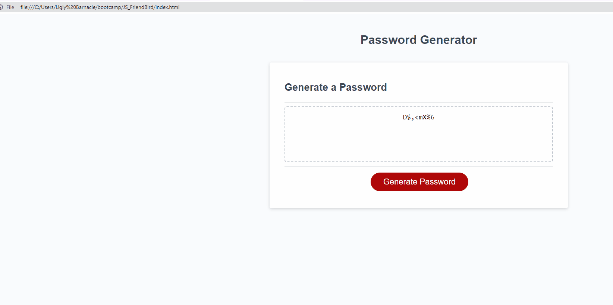

# JS_FriendBird

## Description

- I was tasked to add a working Password Generator for challenge 3.  
- For challenge 3 I had to add JavaScript in order to make a Password Generator. I built it to learn the beginning fundamentals of using JavaScrip.
- I was giving the HTML and CSS files to a "Password Generator" however when I went to the HTML and clicked "Generate Password" button nothing would work.The code had JavaScript connected however most of the code was missing.
- I learned how to use a "while" loop to prompt the user until valid input was received.
I learned how to use conditional statements "if" to check user's choice of characters for the password generator.
I learned how to use a "for" loop to iterate a specific length of password.                     
Used random indicies using "Math.random()" and "Math.floor()"
Used [] to access specific characters within a string
Store and return a generated password. 

## Installation
First step is to open github and create a new repository for Challenge 3 (Give the repo a unique name to help differ it from other projects), Open the files folder and open the newly made repo, There should be nothing but the read.me. Search the files for the UCB bootcamp file (in the same page or new one). Once on the UCB folder search for Challenge 3 in the file and copy Challenge 3 starter code to the NEW REPO we created for the challenge. Once you have copied the code open up the new repo in VS code. The starter code should now be in the folder and be accessible. Open up the HTML to inspect the page. Open up the JavaScript to work in the file and add a password generator that can provide a password up to 8-128 words with every character if needed.  

## Usage

A password generator to practice how to create a password using user input. 

example of the page:

 

## Credits

UCB and Ed.X, Friendbird for starter code.

